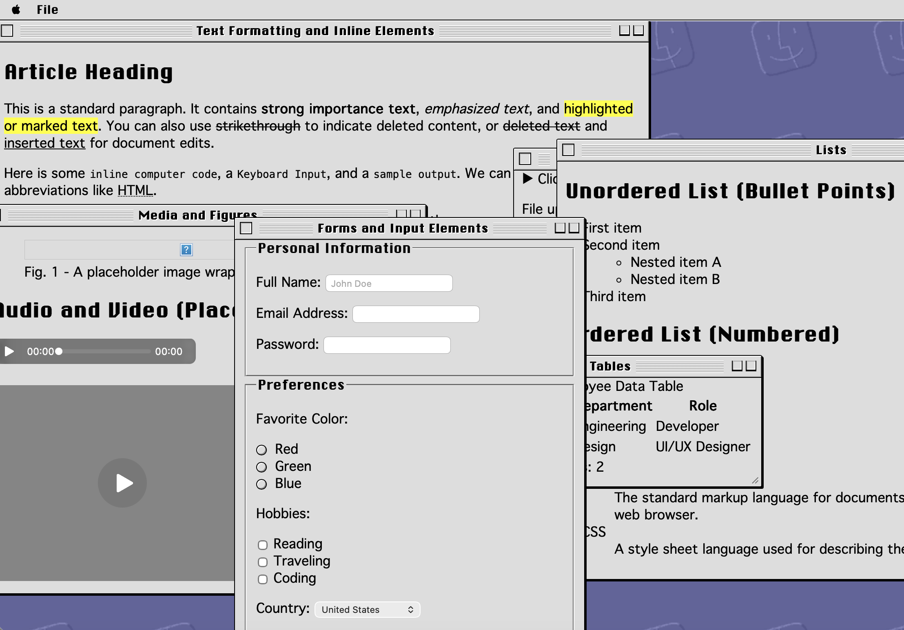

# System 9 CSS

A pure CSS theme that styles semantic HTML to look like classic Mac OS 9 (Platinum).

## Goals

- **Semantic HTML only** — no extra wrapper divs or non-semantic markup; just `<section>`, `<nav>`, `<form>`, `<button>`, etc.
- **Accurate Platinum look** — 3D beveled controls, Chicago/Geneva typography, striped title bars, and the iconic gray UI.
- **Drop-in stylesheet** — link `system9.css` and your semantic HTML becomes a retro desktop.

## Demo

Open `demo.html` to see styled text, lists, tables, forms, media, and draggable windows.

## Reference

For reference images of actual Mac OS 9 see: https://guidebookgallery.org/screenshots/macos90